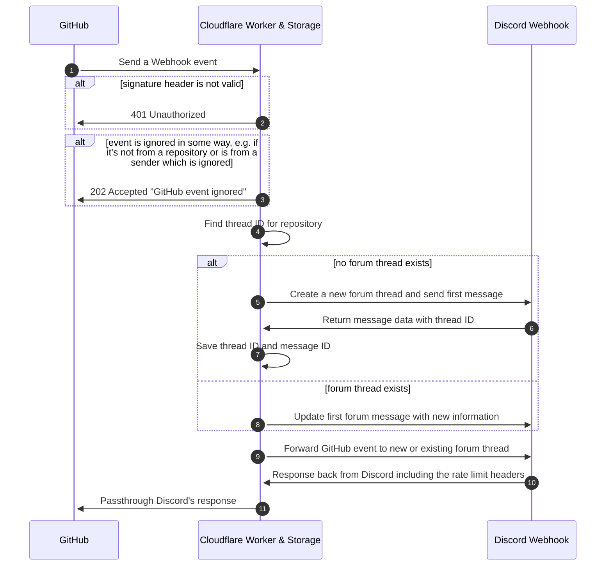

<picture>
  <source media="(prefers-color-scheme: dark)" srcset="https://socialify.git.ci/biaw/gitcord-forum/image?custom_language=Discord&description=1&font=Inter&forks=1&language=1&name=1&owner=1&pattern=Plus&stargazers=1&theme=Dark">
  
</picture>

# Explanation

Instead of having a single Discord channel for all your GitHub repository feeds, or having a separate tech channel for each repository, you can use this worker to create a forum post for each repository and sort your GitHub activity into those forum posts individually. This way, you can have a single channel for all your GitHub activity, but still keep it organized by repository - and users can easily follow the forum posts that they are interested in.

  
Screenshot

  <picture>
    <source media="(prefers-color-scheme: dark)" srcset="https://user-images.githubusercontent.com/10573728/206237592-9104b964-74d6-4a29-a2ab-f36dc400481c.png">
    
  </picture>

# Setting up with Cloudflare Workers

1. Deploy to Cloudflare Workers using the button above. It should be as simple as keeping all defaults, unless you want to change some predefined variables.
2. Insert the two variable secrets, either via the Cloudflare Workers dashboard (recommended) or using the command `wrangler secret put <key>`:
    * `GITHUB_WEBHOOK_SECRET` - your secret for webhooks (like a phrase or a word) to verify that the webhook is coming from GitHub. This needs to match the secret you set in your GitHub webhook settings.
    * `DISCORD_WEBHOOK` - your Discord webhook link (needs to be in a forum channel!). The link should not end in `/github` as the worker will append that automatically.
3. Add your new worker URL (`https://gitcord-forum.WORKER_SUBDOMAIN.workers.dev/`) as a webhook in your GitHub repository settings with your preferred set of notifications to get from the repository. Make sure to set content type to `application/json` and also match the secret you set in the environment variables.
    * You can also add this URL as a webhook for your entire GitHub organization!

Keep in mind that the worker will simply forward the GitHub events to Discord, so you will make sure that Discord has support for the events you want to pass through. See [Discord's documentation](https://discord.com/developers/docs/resources/webhook#execute-githubcompatible-webhook) for a list of supported events. Anything more than this will simply make more requests to the worker and to Discord's API since the worker will not filter out any events, and thus might rate limit the Discord API if you do a lot of stuff at once.

# How the middleware works

