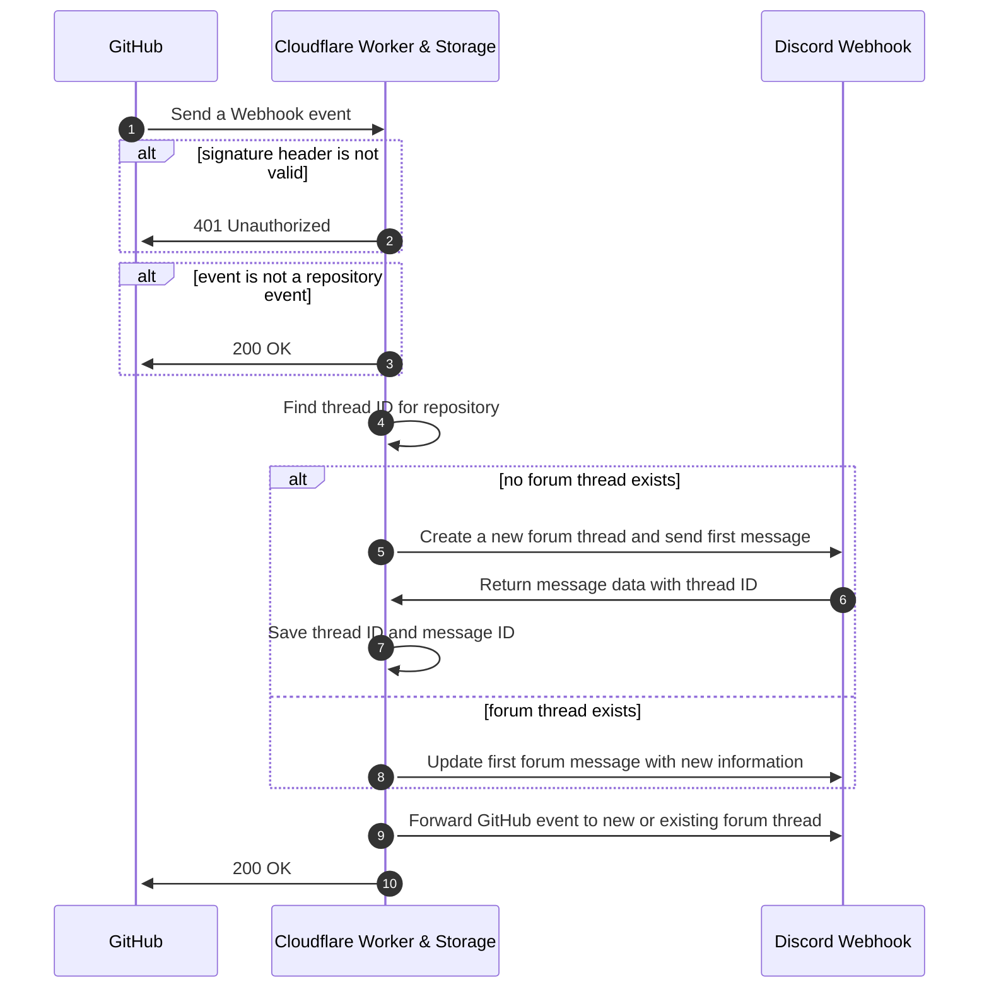

<picture>
  <source media="(prefers-color-scheme: dark)" srcset="https://socialify.git.ci/biaw/gitcord-forum/image?custom_language=Discord&description=1&font=Inter&forks=1&language=1&name=1&owner=1&pattern=Plus&stargazers=1&theme=Dark">
  
</picture>

# Gitcord Forum

## Explanation

Instead of having a single Discord channel for all your GitHub repository feeds, or having a separate tech channel for each repository, you can use this worker to create a forum post for each repository and sort your GitHub activity into those forum posts individually. This way, you can have a single channel for all your GitHub activity, but still keep it organized by repository - and users can easily follow the forum posts that they are interested in.

  
Screenshot

  <picture>
    <source media="(prefers-color-scheme: dark)" srcset="https://user-images.githubusercontent.com/10573728/206237592-9104b964-74d6-4a29-a2ab-f36dc400481c.png">
    
  </picture>

## Setting up with Cloudflare Workers

1. Deploy to Cloudflare Workers using the button above.
2. Insert the environment variables listed in the [`wrangler.toml`](https://github.com/biaw/gitcord-forum/blob/main/wrangler.toml) file. You can either use the `wrangler` command, or do it through the worker dashboard.
3. Add your new worker URL (`https://gitcord-forum.WORKER_SUBDOMAIN.workers.dev/`) as a webhook in your GitHub repository settings with your preferred set of notifications to get from the repository. Make sure to set content type to `application/json` and also match the secret you set in the environment variables.
    * You can also add this URL as a webhook for your entire GitHub organization!

## How the middleware works

