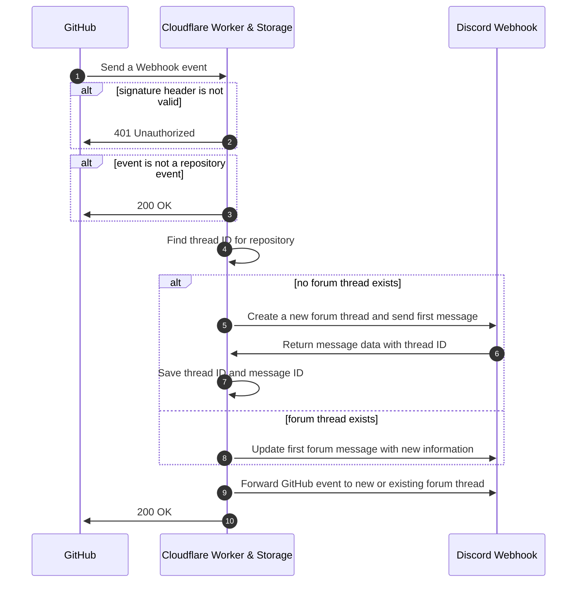

# Gitcord Forum 

A middleware designed to sort your repositories into forum posts.

  
Screenshot

  
  <picture>
    <source media="(prefers-color-scheme: dark)" srcset="https://user-images.githubusercontent.com/10573728/206237592-9104b964-74d6-4a29-a2ab-f36dc400481c.png">
    
  </picture>

## Usage examples

* If you have a lot of projects on your GitHub and you don't want to clog up one channel with all of it but you also don't want to create too many channels for all your repository feeds.

## Setting up with Workers

1. [Deploy with Workers](https://deploy.workers.cloudflare.com/?url=https://github.com/biaw/gitcord-forum)
2. Insert the environment variables listed in the [`wrangler.toml`](https://github.com/biaw/gitcord-forum/blob/main/wrangler.toml) file. You can either use the `wrangler` command, or do it through the worker dashboard.
3. Add your new worker URL (`https://gitcord-forum.WORKER_SUBDOMAIN.workers.dev/`) as a webhook in your GitHub repository settings. Make sure to set content type to àpplication/json` and also match the secret you set in the environment variables.

## How the middleware works

